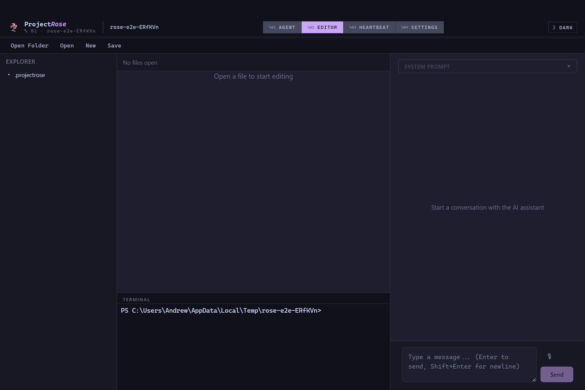
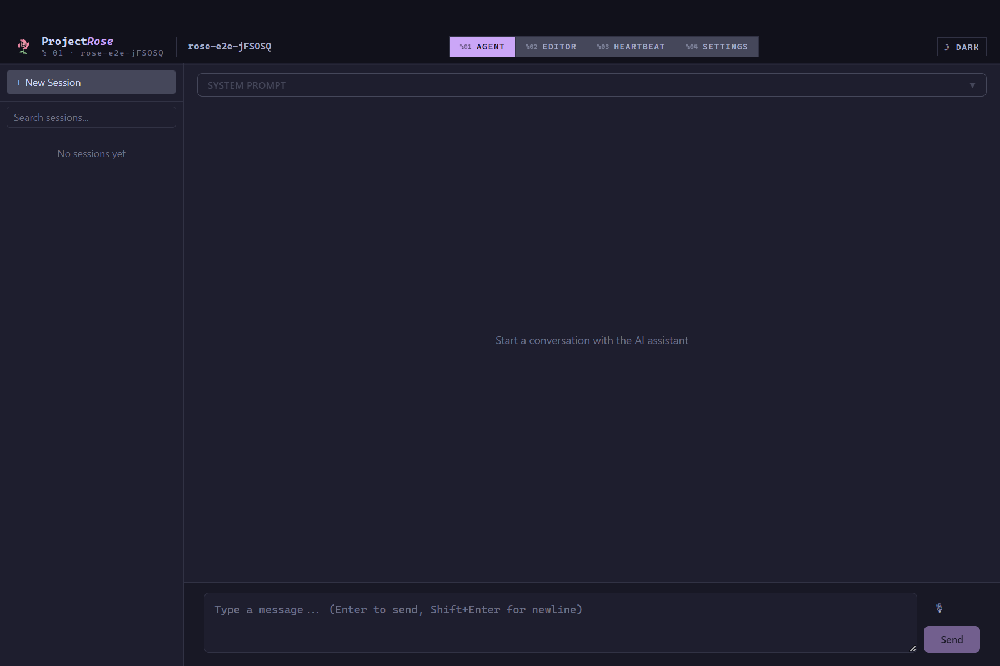
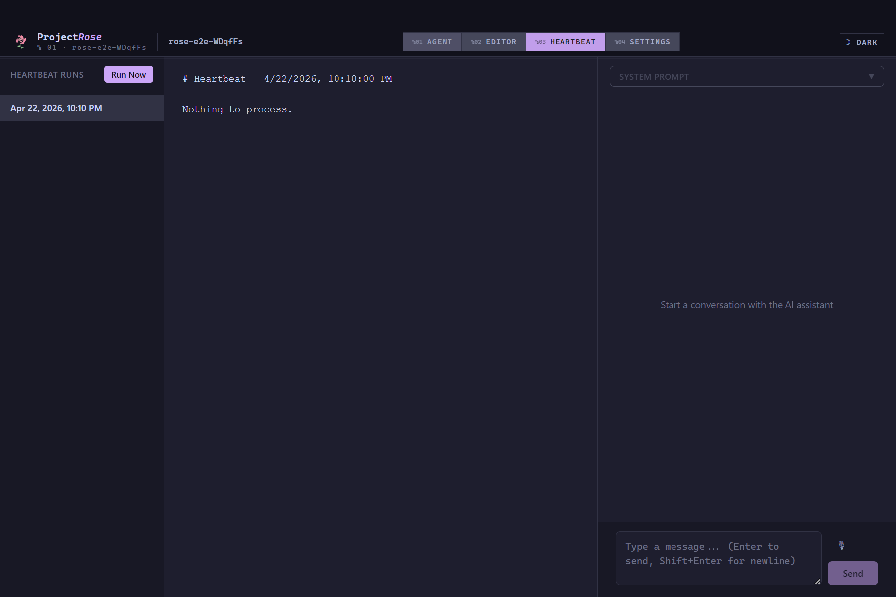

# ProjectRose

ProjectRose is an AI-native desktop IDE and **agent harness** — a platform where AI agents don't just answer questions but take real actions across your development environment. It pairs a full-featured code editor with a first-class agent runtime and an extensible plugin ecosystem, so agents can edit code, run commands, manage infrastructure, and communicate on your behalf.

## Editor

- Monaco Editor (the VS Code engine) with syntax highlighting, IntelliSense, and quick-open file search
- Integrated terminal with full PTY support
- Language Server Protocol for TypeScript and Python (Pyright)
- Multi-file tab management with session persistence

## Agent Runtime

The agent panel lives natively in the IDE sidebar. Agents are tool-use enabled, meaning they invoke extensions to act — not just describe actions.

- **Configurable**: system prompt customization and session management per project
- **Action-oriented**: agents call extension tools directly, with results flowing back into the conversation

### Heartbeat

A background process runs automatically every few minutes — processing deferred notes, executing scheduled tasks, and committing agent-authored changes to git. The Heartbeat view lets you inspect every run.

### Supported AI Providers

| Provider | Models |
|----------|--------|
| **Anthropic** | Claude (Opus, Sonnet, Haiku) |
| **OpenAI** | GPT-4o, GPT-4, and others |
| **Amazon Bedrock** | Claude, Llama, Titan, and other hosted models |
| **Ollama** | Any locally-running model (Llama, Mistral, Gemma, etc.) |
